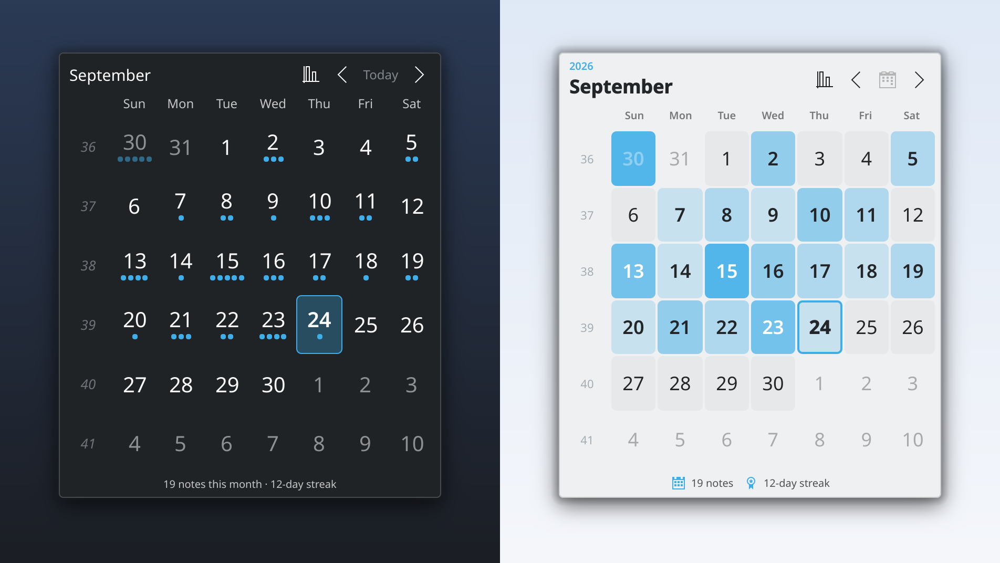
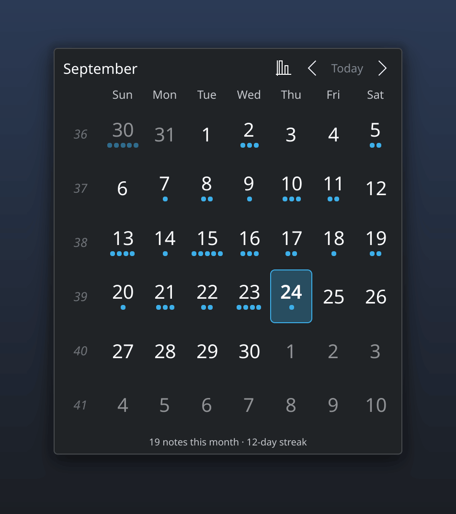
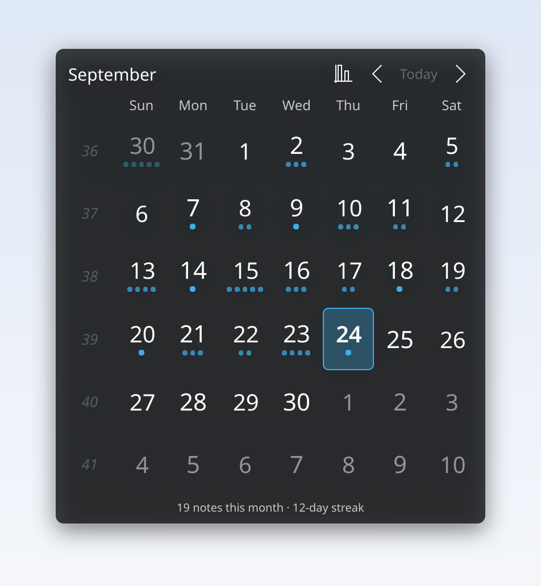
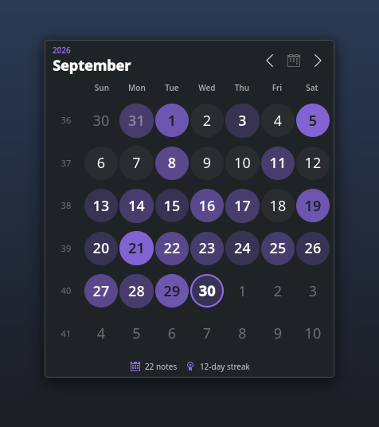
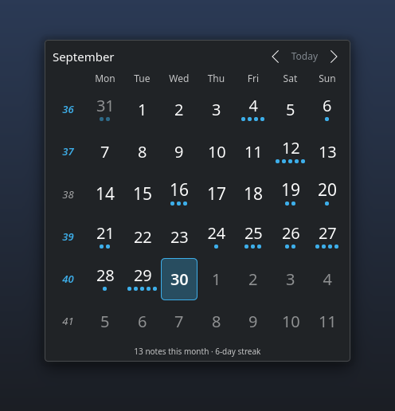
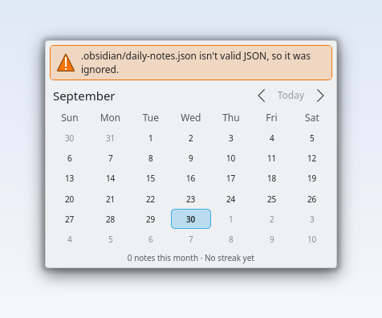
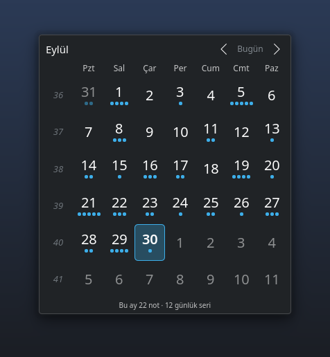

# Calendar for Obsidian

[](https://github.com/diyar4772/obsidian-calendar-plasmoid/actions/workflows/ci.yml)
[](LICENSE)
[](https://kde.org/plasma-desktop/)

**Your Obsidian daily notes on the Plasma desktop. Works alongside the Calendar plugin.**

A KDE Plasma 6 widget that shows a month calendar of the daily notes in your
[Obsidian](https://obsidian.md) vault, on the desktop or in a panel. Days with a
note are marked the way the Obsidian Calendar plugin marks them. Click a day to
open its note in Obsidian, or click today to start today's note from your template.



> [!NOTE]
> This is an unofficial community project. It is not affiliated with or endorsed
> by Obsidian (Dynalist Inc.) or the authors of the Obsidian Calendar and
> Periodic Notes plugins.

## Contents

- [Features](#features)
- [Works with your Obsidian setup](#works-with-your-obsidian-setup)
- [Installation](#installation)
- [Using the widget](#using-the-widget)
- [Settings](#settings)
- [Supported date formats](#supported-date-formats)
- [Privacy and how it works](#privacy-and-how-it-works)
- [Troubleshooting](#troubleshooting)
- [Translations](#translations)
- [Development](#development)
- [License and credits](#license-and-credits)

## Features

- **Reads your Obsidian settings.** The daily note folder and format come from the
  same place Obsidian uses: Periodic Notes, then the core Daily notes plugin, then
  Obsidian's defaults. You don't set anything twice.
- **Calendar plugin look and feel.** One dot per 250 words, up to five (or your
  own *Words per dot*), the same week start and the same week numbers. Weekly notes
  open from the week-number column.
- **Two designs.** *Plasma Native* looks like Plasma's own calendar. *Journal*
  shows the month as a heatmap of how much you wrote.
- **Fits the desktop.** It uses your color scheme, accent color, fonts and
  animation speed, and works in Breeze Light and Breeze Dark. You can also give
  the widget its own color scheme, a custom accent color, a translucent or solid
  background, a larger text size and different spacing.
- **Streaks.** The footer shows how many notes you wrote this month and your
  current streak of consecutive days.
- **Scrolls like Plasma's calendar.** Use two-finger scrolling on a touchpad
  (natural scrolling is respected), the mouse wheel, the keyboard or the buttons.
- **Any size.** Resize it on the desktop from about 160 px upward, or put it in a
  panel as an icon with today's date.
- **Safe and light.** It only reads files. It never changes your vault, never
  scans the whole vault and never uses the network.
- **Clear errors.** A wrong path, a missing folder or a broken config file gets
  a message that tells you what to do. The widget is never just blank.
- **Translated.** Available in English and Turkish.



## Works with your Obsidian setup

The widget reads the configuration files inside your vault's `.obsidian`
folder. You don't need any extra Obsidian plugin.

| Obsidian | What the widget uses |
| --- | --- |
| **Core Daily notes plugin** | Folder, date format and template (`.obsidian/daily-notes.json`). Clicking today opens `obsidian://daily`, so Obsidian creates the note **with your template**. |
| **[Periodic Notes](https://github.com/liamcain/obsidian-periodic-notes)** (0.x and 1.0 beta) | When enabled, its daily settings take priority over the core plugin, like in Obsidian. Its weekly settings power the week-number column. |
| **[Calendar](https://github.com/liamcain/obsidian-calendar-plugin)** | *Start week on*, *Words per dot*, *Show week number*, *Override locale* and its older weekly-note settings. |
| **Templates / Templater** | Your template applies when you click **today**, because Obsidian creates the note itself. |
| **Nested formats** | Formats such as `YYYY/MM/YYYY-MM-DD` or `[Journal/]YYYY-MM-DD` work. Only the folders the format can produce are searched. |

Only plugins that are **enabled** in the vault count, just like in Obsidian.
Every value can also be changed in the widget's settings, for example to use a
different folder than the one Obsidian uses.

What clicking does:

| You click | What happens |
| --- | --- |
| A day with a note | Opens the note (`obsidian://open?path=…`) |
| Today, without a note | Creates today's note from your template (`obsidian://daily`). With a different folder or format set in the widget, it creates the note there without the template. |
| Another day without a note | Nothing (default), or creates an empty note if you choose *Creates the note* |
| A week number | Opens that week's note, when weekly notes are set up |

> [!TIP]
> `obsidian://daily` needs a recent Obsidian version and the **core Daily
> notes** plugin enabled in Obsidian. If you only use Periodic Notes, clicking
> today creates the note at the right path, but without the template. Enabling the core plugin as well fixes
> that; its own settings don't matter while Periodic Notes is active.

## Installation

- **KDE Plasma 6.** Developed and tested on Plasma 6.7 with Qt 6.11 on Fedora 44.
  It should work on any Plasma 6 release. With KDE Frameworks older than 6.2
  (Plasma 6.0) some corners are square instead of rounded.
- **Obsidian** with its `obsidian://` link handler, which the Flatpak, RPM,
  AppImage and `.deb` builds all register. The Flatpak build works as long as the
  vault is in a folder the Flatpak can see (your home folder is fine).

### From Discover or the KDE Store

*Coming soon.* Once published, open **Discover → Plasma Addons → Plasma
Widgets** and search for *Calendar for Obsidian*. You can also right-click the
desktop, choose **Add or Manage Widgets… → Get New Widgets… → Download New
Plasma Widgets** and search there. On Fedora and other distributions this uses
the same [KDE Store](https://store.kde.org).

Discover shows a warning that the widget "runs executables". It does, but only
the read-only commands listed under
[Privacy and how it works](#privacy-and-how-it-works).

### From a release file

Download `obsidian-calendar-<version>.plasmoid` from the
[Releases](https://github.com/diyar4772/obsidian-calendar-plasmoid/releases) page, then:

```bash
kpackagetool6 -t Plasma/Applet -i obsidian-calendar-<version>.plasmoid   # install
kpackagetool6 -t Plasma/Applet -u obsidian-calendar-<version>.plasmoid   # upgrade
```

### From source

```bash
git clone https://github.com/diyar4772/obsidian-calendar-plasmoid.git
cd obsidian-calendar-plasmoid
scripts/i18n.sh compile                              # translations (needs gettext and Node.js)
kpackagetool6 -t Plasma/Applet -i package            # or -u to upgrade
```

Then right-click the desktop or a panel, choose **Add or Manage Widgets…** and
add **Calendar for Obsidian**. Pick your vault when the widget asks for it: the
settings list the vaults Obsidian already knows, or you can browse for the folder.

To remove it: `kpackagetool6 -t Plasma/Applet -r io.github.diyar4772.obsidiancalendar`.

## Using the widget

| Action | How |
| --- | --- |
| Previous / next month | Arrow buttons, mouse wheel, two-finger scroll, <kbd>Page Up</kbd> / <kbd>Page Down</kbd> |
| Back to today | **Today** button or <kbd>Ctrl</kbd>+<kbd>Home</kbd> |
| Move between days | Arrow keys (they cross into the next or previous month), <kbd>Enter</kbd> / <kbd>Space</kbd> to open |
| See a note's path and word count | Hover over the day |
| Open today's note, open the vault, rescan | Right-click the widget |
| Settings | Right-click → **Configure Calendar for Obsidian…** |
| Move or resize on the desktop | Press and hold the widget, or use edit mode (right-click the desktop → **Enter Edit Mode**) |

With Qt 6.9 or newer, mouse drags don't change the month, so they don't get in
the way of moving the widget. On older Qt, dragging with the mouse also scrolls.

## Settings



- **General:** the vault (type a path, browse, or pick one of the vaults listed in
  Obsidian's own settings), and how often to look for new notes (default: every
  60 seconds; the widget also rescans whenever it's shown).
- **Notes:** what was detected in the vault and where it came from, an optional
  different folder and format for daily and weekly notes (with a live preview
  of today's file name), the language of month and day names in note names,
  and what clicking a day without a note does.
- **Calendar:** the first day of the week, week numbers (Calendar plugin setting,
  on or off; locale or ISO 8601), and how note length is shown (word count like
  the Calendar plugin, file size, or not at all). Also the *notes this month /
  streak* footer and today's date next to the panel icon.
- **Appearance:** the design (Plasma Native or Journal), a color scheme for the
  widget (any installed KDE color scheme, or the same as Plasma), the accent
  color, the background (Plasma standard, Plasma translucent, a solid color with
  adjustable opacity, or none), the text size, the spacing, and the day shape
  in the Journal design (rounded, circle or square).

| | |
| --- | --- |
|  |  |
| Custom accent color, round days | Periodic Notes with weekly notes |
|  |  |
| A broken config file is reported | Follows the desktop language |

## Supported date formats

Note names are built from the date with the same
[moment.js format tokens](https://momentjs.com/docs/#/displaying/format/) Obsidian uses:

| Tokens | Meaning | Example |
| --- | --- | --- |
| `YYYY` `YY` | Year | `2026`, `26` |
| `Q` | Quarter | `3` |
| `M` `MM` `MMM` `MMMM` | Month | `9`, `09`, `Sep`, `September` |
| `D` `DD` `Do` | Day of the month | `5`, `05`, `5th` |
| `DDD` `DDDD` | Day of the year | `248`, `248` |
| `d` `ddd` `dddd` `e` `E` | Day of the week | `6`, `Sat`, `Saturday` |
| `w` `ww` `gg` `gggg` | Locale week and week-year | `36`, `2026` |
| `W` `WW` `GG` `GGGG` | ISO week and week-year | `36`, `2026` |
| `[text]` `\x` | Literal text | `[Week] ww` gives `Week 36` |

Time-of-day and time-zone tokens (`HH`, `mm`, `Z`, …) can't be part of a daily
note name. If your format uses one, the widget says so instead of guessing.

Month and day names follow the desktop language when it's English or Turkish.
Other languages use English names, which is also Obsidian's default. You can
choose the language in *Notes → Language of note names*.

## Privacy and how it works

The widget runs a few fixed, **read-only** shell commands through Plasma's
`executable` data engine. The vault path and file names are always passed
single-quoted, so they can't run code:

1. read (`head`) the few JSON files it needs from `.obsidian`,
2. `find` the Markdown files under the daily notes folder, only as deep as your
   format can go and skipping hidden folders such as `.obsidian` and `.trash`,
   printing NUL-separated names so any file name is safe,
3. read the start of the notes in the month on screen, to count words
   (frontmatter is skipped; results are cached until a file changes).

To offer your vaults in the settings, it also reads Obsidian's own vault list
(`obsidian.json`) when you open them.

Nothing is written, nothing is sent anywhere, and the rest of your vault is never
read. Symbolic links to notes and to folders below the notes folder aren't
followed. The notes folder itself may be a link, but only to a place inside the
vault, so the widget never reads outside the vault you chose. Text from your
vault is always shown as plain text. Word counting runs in a background thread,
so long notes don't slow the desktop down. Word counts follow the Calendar
plugin's rules, so the dots are usually the same as in Obsidian. They can differ a little, because frontmatter isn't counted
and only the beginning of very long notes is read.

## Troubleshooting

<details>
<summary><b>"Not an Obsidian vault"</b></summary>

Choose the vault's top folder: the one that contains the hidden `.obsidian`
folder, not a subfolder.
</details>

<details>
<summary><b>Days with notes aren't marked</b></summary>

Open **Configure → Notes** and check *Detected*. It shows the folder, the format
and which plugin they came from. If your notes live somewhere else, tick
*Use a different folder and format*. The preview shows the file name the widget
looks for today.
</details>

<details>
<summary><b>Weekly notes aren't highlighted</b></summary>

Week numbers in note names (`ww`, `gggg`) depend on the first day of the week.
Obsidian takes it from the Calendar plugin's *Start week on* setting or from
Obsidian's language, which is English by default (weeks starting on Sunday); the
widget takes it from the Calendar plugin or from your desktop. If they differ,
set **Configure → Calendar → Week starts on** to match Obsidian. Formats with
ISO weeks (`GGGG-[W]WW`) always match.
</details>

<details>
<summary><b>"The daily notes folder links to a place outside the vault"</b></summary>

The notes folder is a symbolic link to somewhere outside the vault. The widget
only reads inside the vault you chose. Choose the real folder as the vault, or
move the notes into the vault.
</details>

<details>
<summary><b>"The vault didn't respond"</b></summary>

Reading the vault took more than 20 seconds, usually because it's on a network
share or an external drive that is asleep or disconnected. The widget tries again
at the next rescan, or right-click → **Rescan Vault**.
</details>

<details>
<summary><b>Clicking a day does nothing</b></summary>

Days without a note do nothing by default; see *Clicking a day without a note*
under **Notes**. If a link can't be opened, the widget says so. Check that
Obsidian is installed and that `xdg-open "obsidian://open"` opens it.
</details>

<details>
<summary><b>Today's note doesn't use my template</b></summary>

`obsidian://daily` belongs to the core Daily notes plugin. Enable it in Obsidian
(see the tip in [Works with your Obsidian setup](#works-with-your-obsidian-setup)).
</details>

<details>
<summary><b>I can't move the widget or open its settings</b></summary>

On the desktop, press and hold the widget before dragging it, or right-click the
desktop and choose **Enter Edit Mode**. Right-clicking the widget gives
**Configure…**. In `plasmoidviewer` (the development tool) there's no right-click
menu; use its toolbar instead.
</details>

<details>
<summary><b>Translations don't show up</b></summary>

Translations are loaded for installed widgets. When installing from source, run
`scripts/i18n.sh compile` before `kpackagetool6`.
</details>

## Translations

Translations live in [`po/`](po/). To add a language:

```bash
scripts/i18n.sh extract                                    # refresh the template
msginit -i po/plasma_applet_io.github.diyar4772.obsidiancalendar.pot -o po/<lang>.po -l <lang>
# translate po/<lang>.po, then:
scripts/i18n.sh compile
```

Pull requests with new languages are very welcome.

## Development

Everything is plain QML and JavaScript. There's nothing to compile.

```text
package/                  the Plasma package (what gets installed)
├── metadata.json
└── contents/
    ├── code/             logic as QML JavaScript libraries (.pragma library), plus
    │                     the word counter as an ES module used by a WorkerScript
    ├── config/           KConfigXT schema and settings pages
    └── ui/               QML views, the vault scanner, settings pages
po/                       translations
scripts/                  fixtures, i18n, lint, screenshots, packaging
tests/                    Node tests for the JavaScript libraries
```

Requirements: Node.js 22+ (tests only, no dependencies), `qmllint` (Fedora:
`qt6-qtdeclarative-devel`), `plasmoidviewer` (Fedora: `plasma-sdk`) and gettext.

```bash
npm test                               # unit and end-to-end tests
npm run lint                           # qmllint (zero warnings) + translation template check
scripts/smoke-test.sh                  # load the installed widget offscreen, fail on QML errors
npm run fixtures                       # fictional demo vaults in tests/fixtures/
plasmoidviewer -a package              # try it (no translations; no right-click menu)
scripts/screenshots.sh                 # regenerate docs/screenshots (offscreen)
npm run build                          # build/obsidian-calendar-<version>.plasmoid
```

The tests load the QML JavaScript libraries directly in Node. They cover the
date formatter (compared with moment.js), week numbering around New Year,
DST-safe date math, config resolution for every plugin combination, shell
quoting with hostile and non-ASCII paths (the commands really run), word counts
compared with the Calendar plugin, and the whole read pipeline against the
generated vaults. The demo vaults are fictional, and their dates are relative to
today, so screenshots always look current.

Releases: bump `Version` in `package/metadata.json`, update
[CHANGELOG.md](CHANGELOG.md), and push a `v<version>` tag. The release workflow
builds the `.plasmoid` and attaches it to a GitHub release.

## License and credits

Calendar for Obsidian is licensed under the
[GNU General Public License v2.0 or later](LICENSE).

- Word counting follows the [Obsidian Calendar plugin](https://github.com/liamcain/obsidian-calendar-plugin)
  by Liam Cain (MIT), and settings are read the way
  [obsidian-daily-notes-interface](https://github.com/liamcain/obsidian-daily-notes-interface) does.
- The date formatter uses moment.js's token pattern and week algorithm
  ([moment.js](https://momentjs.com), MIT).
- Month scrolling follows Plasma's own calendar (`org.kde.plasma.workspace.calendar`).

The MIT license text is in [LICENSES/MIT.txt](LICENSES/MIT.txt). "Obsidian" is a
trademark of Dynalist Inc. and is used here only to describe what the widget
works with.
